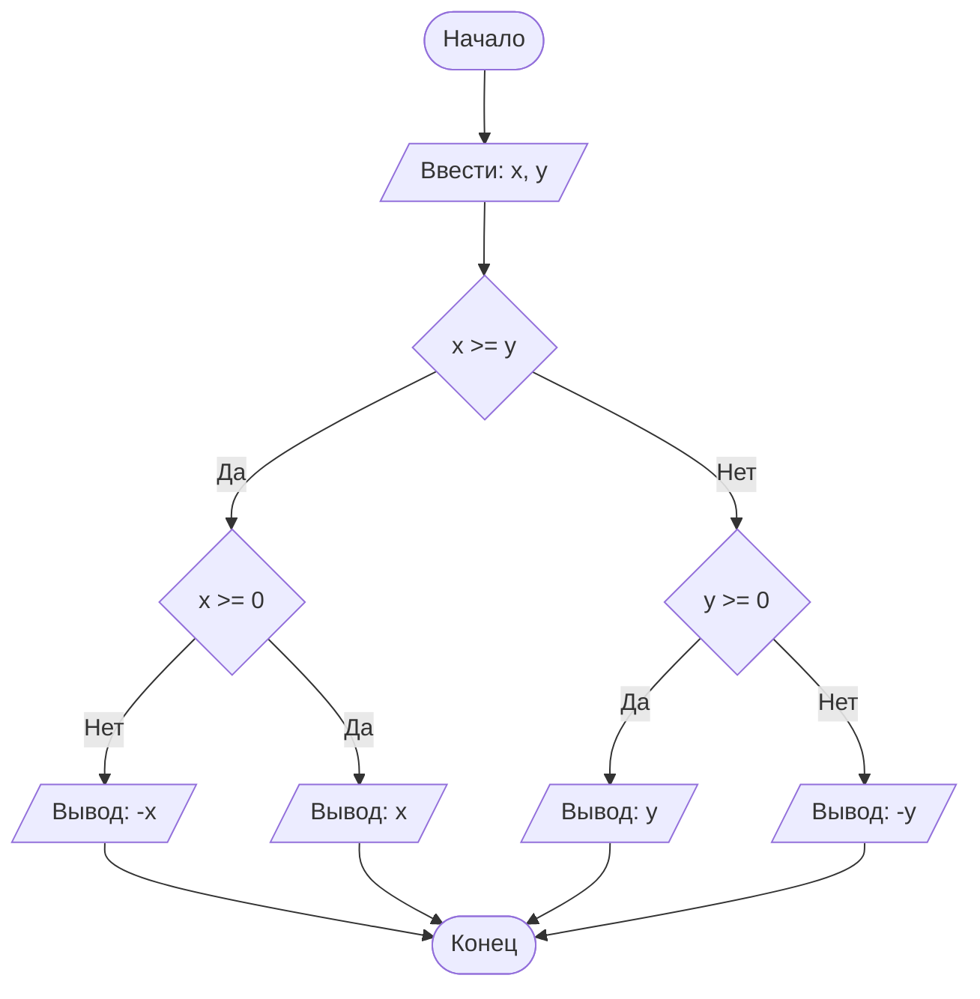

## Отчет по лабораторной работе № 2

#### № группы: `ПМ-2401`

#### Выполнил: `Ядыкин Максим Михайлович`

#### Вариант: `31`

### Cодержание:

- [Постановка задачи](#1-постановка-задачи)
- [Входные и выходные данные](#2-входные-и-выходные-данные)
- [Выбор структуры данных](#3-выбор-структуры-данных)
- [Алгоритм](#4-алгоритм)
- [Программа](#5-программа)
- [Анализ правильности решения](#6-анализ-правильности-решения)

### 1. Постановка задачи

> Напишите программу на Java, которая выполняет следующие действия
> с одномерным массивом чисел Фибоначчи:
> 1. Считывает с консоли число N и генерирует массив первых N чисел
Фибоначчи.
> 2. Сортирует массив в порядке возрастания количества цифр в числе.
Если количества цифр равны, сортирует в порядке убывания числа.
> 3. Находит и выводит сумму всех нечётных чисел в массиве
> 4. Выводит элементы массива, заменяя каждое число на его двоичное
представление.
> 5. Заменяет каждое число в массиве на сумму его цифр и выводит
полученный массив.

Данная задача имеет 5 подзадач:
1. Пользователь вводит число N, которое будет задавать длинну массива. Потом при помощи формулы заполняется массив первыми числами последовательности Фибоначчи.
2. Сортировка массива таким образом, что в начале идут однозначные числа по убыванию, потом двузначные по убыванию и т.д. Например: `6, 2, 1, 65, 43, 29, 355, 212...`
3. Находится сумма всех нечетных чисел и выводится на экран.
4. Каждое число переводится в двоичную систему представления и выводится на экран.
5. Находится сумма цифр числа, которая записывается в массив вместо него. Выводится получившийся массив.

### 2. Входные и выходные данные

#### Данные на вход

На вход программа должна получать 1 число, так как это будет длиная массива, то число должно быть натуральным. Вверхняя граница не данна, тогда пусть ей будет 10<sup>9</sup>.

|   | Тип         | min значение    | max значение   |
|---|-------------|-----------------|----------------|
| N | Целое число | 1               | 10<sup>9</sup> |

#### Данные на выход

Т.к. программа должна вывести сумму элементов массива и обработанные элементы массива, а числа Фибоначчи натуральные, то на выход мы получим натуральное число, строка, так как ищем двоичное представление числа, и целочисленный массив.

|                        | Тип                  | min значение | max значение   |
|------------------------|----------------------|--------------|----------------|
| Сумма чисел            | Целое число          | 1            | 10<sup>9</sup> |
| Двоичное представление | Строка               | 1            | 10<sup>9</sup> |
| Массив                 | Целочисленный массив | 1            | 10<sup>9</sup> |

### 3. Выбор структуры данных

Программа получает 1 натуральное число, не меньше 1 и не превышающего 10<sup>9</sup>. Поэтому для его хранения
можно выделить 1 переменную (`n`) типа `int`. Нам нужно сгенерировать последовательность Фибоначчи, числа которой натуральные, значит нужно создать целочисленный массив. 
Создаем еще один целочисленный массив для сортировки. Чтобы получить двоичное представление чисел, выделяем переменну (`y`) типа `String` и выделяем еще одну переменную (`r`) типа `String`, чтобы развернуть строку.

|              | название переменной | Тип (в Java) | 
|--------------|---------------------|--------------|
| N (Число 1)  | `n`                 | `int`        |
| A (Массив 1) | `a`                 | `int`        |
| B (Массив 2) | `b`                 | `int`        |
| Y (Строка 1) | `y`                 | `String`     | 
| R (Строка 1) | `r`                 | `String`     |

### 4. Алгоритм

#### Алгоритм выполнения программы:

1. **Ввод данных:**  
   Программа считывает одно целое число, обозначенное как `n`.

2. **Генерация последовательности:**  
   Программа создает целочисленнй массив `a` длины `n`, в который записывает первые числа Фибоначчи. Первый и второй элемент присваеваются "вручную", остальные генерируются при помощи цикла со счетчиком и реккурентной формулы.

3. **Сортировка массива:**
    - Создается целочисленный массив `b`, куда записывается количество цифр чисел Фибоначчи. Чтобы посчитать количество цифр в числе, нужно задать счетчик и считать сколько раз можно поделить число нацело на 10, пока не останется 0.
    - Перебираем элементы двух массивов, и если количество цифр текущего и следующего числа совпадаю, а текущее число меньше следующего, то меняем их местами. 

4. **Сумма нечетных чисел:**  
   Программа создает переменную `s` и присваевывает ей значение 0. Перебираются элементы последовательности, и если остаток от деления не равен 0, то прибавляем значение к `s`.

#### Блок-схема



### 5. Программа

```java
import java.io.PrintStream;
import java.util.Scanner;

public class Main {
    // Объявляем объект класса Scanner для ввода данных
    public static Scanner in = new Scanner(System.in);
    // Объявляем объект класса PrintStream для вывода данных
    public static PrintStream out = System.out;

    public static void main(String[] args) {
        // Считывание двух вещественных чисел x и y из консоли
        double x = in.nextDouble();
        double y = in.nextDouble();

        // Определение максимального числа
        if (x >= y) {
            // Если x положительное, выводим x, иначе выводим -x,
            // чтобы на выходе было его абсолютное значение
            if (x >= 0) {
                out.println(x);
            } else {
                out.println(-x);
            }
        } else {
            // Если x положительное, выводим y, иначе выводим -y,
            // чтобы на выходе было его абсолютное значение
            if (y >= 0) {
                out.println(y);
            } else {
                out.println(-y);
            }
        }
    }
}
```

### 6. Анализ правильности решения

Программа работает корректно на всем множестве решений с учетом ограничений.

1. Тест на `X > Y > 0`:

    - **Input**:
        ```
        5 1.3
        ```

    - **Output**:
        ```
        5
        ```

2. Тест на `X < Y < 0`:

    - **Input**:
        ```
        -4 -2.2
        ```

    - **Output**:
        ```
        2.2
        ```

3. Тест на `X < 0 < Y`:

    - **Input**:
        ```
        -4 5
        ```

    - **Output**:
        ```
        5
        ```

4. Тест на `X = 0` или `Y = 0`:

    - **Input**:
        ```
        0 -3
        ```

    - **Output**:
        ```
        3
        ```

5. Тест на ограничение задачи:

    - **Input**:
        ```
        -1000000000 1000000000
        ```

    - **Output**:
        ```
        1000000000
        ```
